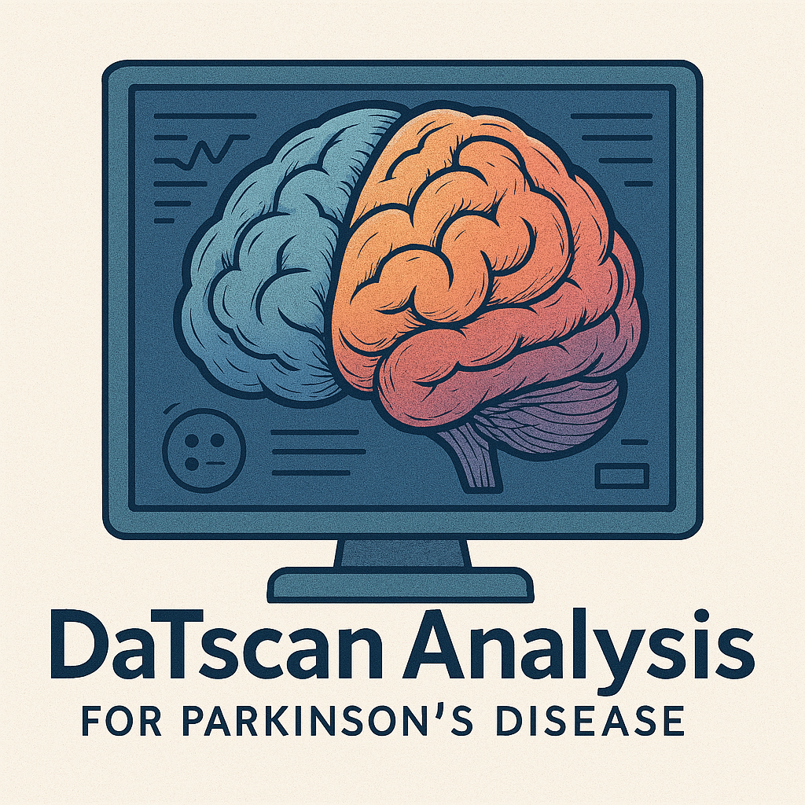

<div style="display: flex; align-items: center;">
  
  <h1 style="margin: 0;">DaTscan Analysis for Parkinson's Disease</h1>
</div>

Este projeto fornece uma ferramenta para análise de cortes transversais do cérebro a partir de imagens DaTScan (SPECT) no contexto da doença de Parkinson. Ele processa arquivos DICOM de pacientes, calcula métricas como o SBR (Specific Binding Ratio) para regiões cerebrais específicas (caudado e putâmen), realiza análise de assimetria e gera imagens das fatias alinhadas com o atlas. O resultado é exportado em arquivos CSV para cada paciente, contendo um resumo e métricas detalhadas, além de uma pasta com 32 imagens por paciente.

O programa está disponível como um executável para Windows (`datscan_analysis.exe`), facilitando o uso por usuários sem conhecimento de programação. Para desenvolvedores ou pesquisadores, o código-fonte em Python também está incluído.

## Estrutura do Repositório

- **`/build/`**: Diretório gerado durante a criação do executável (pode ser ignorado).
- **`/NeuroData/`**: Diretório de exemplo com dados de pacientes (de `Paciente 1` a `Paciente 5`). Cada subpasta `Paciente X` contém uma pasta `series4` com o arquivo `Trodat1.dcm`. Os usuários devem substituir este diretório pelos seus próprios dados.
- **`/datscan_analysis.py`**: Código-fonte em Python do programa.
- **`/datscan_analysis.spec`**: Arquivo de configuração (usado para personalizar a criação do executável).
- **`/notebook.ipynb`**: Notebook Jupyter com exemplos ou análises adicionais (opcional, para documentação ou exploração).
- **`/requirements.txt`**: Lista de dependências Python necessárias para rodar o código-fonte.

## Como Usar o Executável (`datscan_analysis.exe`)

O executável foi projetado para ser fácil de usar, sem necessidade de instalar Python ou outras dependências. Ele é compatível com sistemas Windows.

### Pré-requisitos
- Um computador com Windows (testado em Windows 10 e 11).
- Arquivos DICOM (`.dcm`) de pacientes, organizados no formato descrito abaixo.

### Estrutura de Dados Esperada
O programa pode processar:
- **Um único arquivo DICOM**: Selecione um arquivo `.dcm` para processar um único paciente.
- **Uma pasta com múltiplos pacientes**: A pasta deve conter subpastas no formato `Paciente X`, onde cada subpasta contém:
  - Uma pasta `series4` com o arquivo `Trodat1.dcm`.

Exemplo de estrutura:
```
minha_pasta/
├── Paciente 1/
│   └── series4/
│       └── Trodat1.dcm
├── Paciente 2/
│   └── series4/
│       └── Trodat1.dcm
...
```

### Passos para Uso
1. **Baixe o Executável**:
   - Devido à limitação de tamanho de arquivo do GitHub (25 MB), o executável `datscan_analysis.exe` foi hospedado no Google Drive.
   - Acesse o link a seguir para baixar o arquivo: [Baixar datscan_analysis.exe](https://drive.google.com/file/d/10NZXKFvZ91lq97d-R9tzjoi0QkStEXcr/view?usp=sharing).
   - Clique em "Fazer Download" e aguarde o arquivo ser baixado.

2. **Coloque o Executável em um Diretório**:
   - Mova o `datscan_analysis.exe` para um diretório de sua escolha (ex.: `C:\Meus_Projetos\DaT_Scan_Analysis\`).

3. **Prepare os Dados**:
   - Organize seus arquivos DICOM conforme a estrutura descrita acima.
   - Coloque os dados no mesmo diretório do executável ou em um diretório separado (você selecionará a pasta durante a execução).

4. **Execute o Programa**:
   - Dê um duplo clique no `datscan_analysis.exe`.
   - Uma janela gráfica aparecerá com três botões:
     - **Selecionar Arquivo DICOM**: Para processar um único arquivo `.dcm`.
     - **Selecionar Pasta com Pacientes**: Para processar uma pasta com múltiplos pacientes.
     - **Fechar**: Para encerrar o programa.

5. **Selecione os Dados**:
   - Clique em "Selecionar Arquivo DICOM" para escolher um arquivo `.dcm`, ou "Selecionar Pasta com Pacientes" para escolher uma pasta.
   - Uma janela de seleção será aberta. Escolha o arquivo ou pasta e clique em "Abrir" ou "Selecionar Pasta".

6. **Aguarde o Processamento**:
   - O programa processará os dados e gerará arquivos CSV e imagens no mesmo diretório onde o `datscan_analysis.exe` está localizado.
   - Para cada paciente, dois arquivos serão gerados:
     - `paciente_X_resumo.csv`: Resumo com SBR e análise de assimetria.
     - `paciente_X_completo.csv`: Métricas detalhadas por fatia.
     - `paciente_X_images/`: Pasta contendo 32 imagens PNG das fatias alinhadas com o atlas (nomeadas como `slice_0.png` a `slice_31.png`).
   - Se você processar uma pasta com múltiplos pacientes, um arquivo adicional será gerado:
     - `resultados_todos_pacientes.csv`: Combinação dos resultados de todos os pacientes.

7. **Verifique os Resultados**:
   - Após o processamento, uma mensagem de sucesso aparecerá.
   - Abra os arquivos CSV gerados (ex.: com Excel ou outro software) para analisar os resultados.
   - Explore as pastas `paciente_X_images/` para visualizar as imagens das fatias alinhadas.

8. **Feche o Programa**:
   - Clique no botão "Fechar" ou no "X" da janela para encerrar o programa.

### Exemplo de Uso
Se você tiver uma pasta `MeusDados` com a seguinte estrutura:
```
MeusDados/
├── Paciente 1/
│   └── series4/
│       └── Trodat1.dcm
├── Paciente 2/
│   └── series4/
│       └── Trodat1.dcm
```
- Coloque o `datscan_analysis.exe` no mesmo diretório de `MeusDados`.
- Execute o `.exe`, clique em "Selecionar Pasta com Pacientes", e escolha a pasta `MeusDados`.
- Após o processamento, você encontrará os arquivos CSV e as pastas com imagens no mesmo diretório do `.exe`.

## Para Desenvolvedores: Rodando o Código Python

Se você deseja modificar o código ou executá-lo diretamente, siga os passos abaixo.

### Pré-requisitos
- Python 3.10 ou superior instalado.
- Um ambiente virtual (recomendado).

### Passos
1. **Clone o Repositório**:
   ```
   git clone https://github.com/WoolierBrooks/Trodat-Neuro-Analyzer.git
   cd Trodat-Neuro-Analyzer
   ```

2. **Crie e Ative um Ambiente Virtual**:
   No Windows:
   ```
   python -m venv venv
   venv\Scripts\activate
   ```

3. **Instale as Dependências**:
   ```
   pip install -r requirements.txt
   ```
   O arquivo `requirements.txt` contém:
   ```
   antspyx==0.5.4
   matplotlib==3.10.1
   nilearn==0.11.1
   numpy==2.2.4
   pandas==2.2.3
   pydicom==2.4.3
   SimpleITK==2.4.1
   scipy==1.15.2
   ```

4. **Execute o Código**:
   ```
   python datscan_analysis.py
   ```
   - Uma janela gráfica aparecerá, e você pode seguir os mesmos passos descritos na seção "Como Usar o Executável".

### Gerando o Executável
Se você deseja gerar o executável a partir do código-fonte:
1. Instale o PyInstaller:
   ```
   pip install pyinstaller
   ```
2. Gere o executável:
   ```
   pyinstaller --onefile --noconsole datscan_analysis.py
   ```
   - O executável será gerado na pasta `dist`.

## Notas
- **Tamanho do Executável**: O `datscan_analysis.exe` é grande (500-800 MB) devido às bibliotecas incluídas (ex.: `nilearn`, `pandas`, `scipy`). Para evitar a limitação de tamanho de arquivo do GitHub (25 MB), o executável foi hospedado no Google Drive em vez de ser dividido em várias partes.
- **Compatibilidade**: O executável foi testado em Windows 10 e 11. Para outros sistemas operacionais, você precisará rodar o código Python diretamente ou gerar um executável específico.
- **Dados de Exemplo**: O diretório `/NeuroData/` contém dados de exemplo (de `Paciente 1` a `Paciente 5`). Substitua esses dados pelos seus próprios arquivos DICOM.

## Contribuições
Sinta-se à vontade para abrir issues ou pull requests se encontrar problemas ou tiver sugestões de melhorias.

## Licença
Este projeto está licenciado sob a GNU General Public License v3.0 - veja o arquivo [LICENSE](LICENSE) para mais detalhes.
